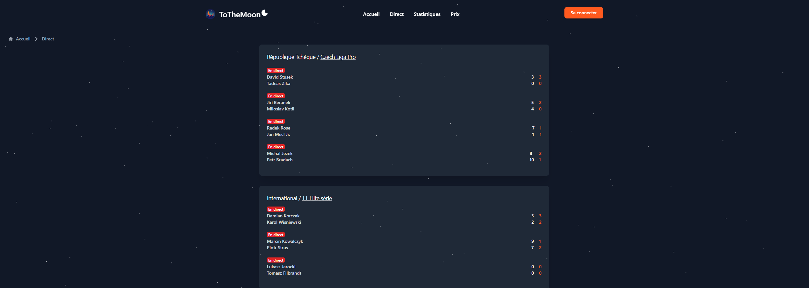

# ToTheMoon

## Captures d'écran

## Description

ToTheMoon est une application web développée avec Symfony pour suivre les scores en direct et les statistiques de matchs de tennis de table.

## Fonctionnalités

- Affichage des scores en direct : Suivez les scores en direct des matchs de tennis de table de la Czech Liga Pro.
- Statistiques détaillées : Consultez les statistiques détaillées des matchs passés.
- Interface conviviale : Interface utilisateur intuitive pour une navigation facile.

## Installation

1. Clonez ce dépôt
2. Installez les dépendances : `composer install`
3. Configurez la base de données dans le fichier `.env`
4. Créez la base de données : `php bin/console doctrine:database:create`
5. Appliquez les migrations : `php bin/console doctrine:migrations:migrate`

## Utilisation

1. Lancez le serveur Symfony : `symfony server:start`
2. Accédez à l'application dans votre navigateur à l'adresse `http://localhost:8000`
